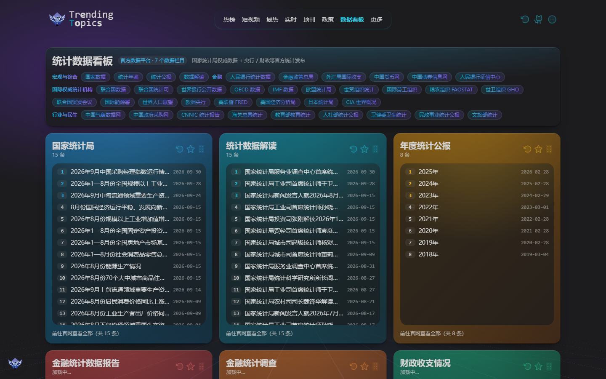
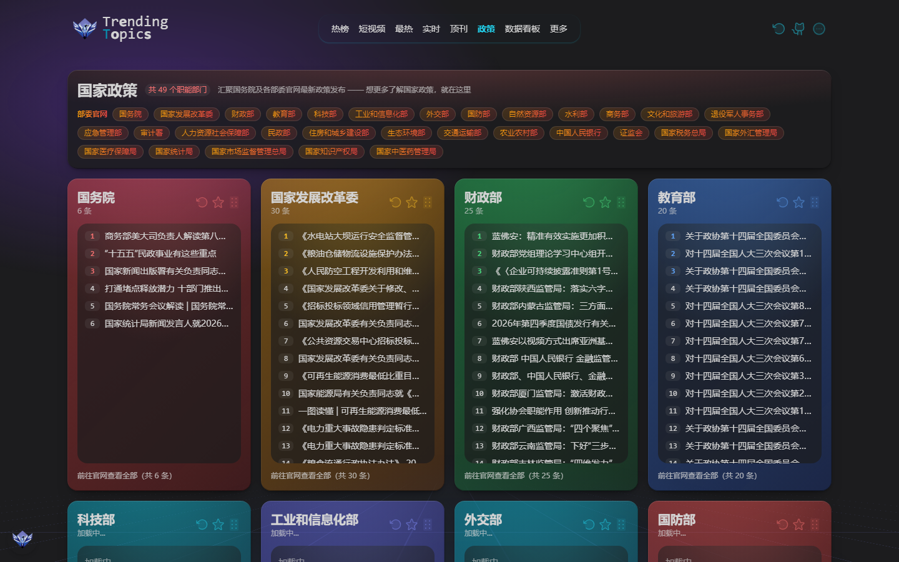
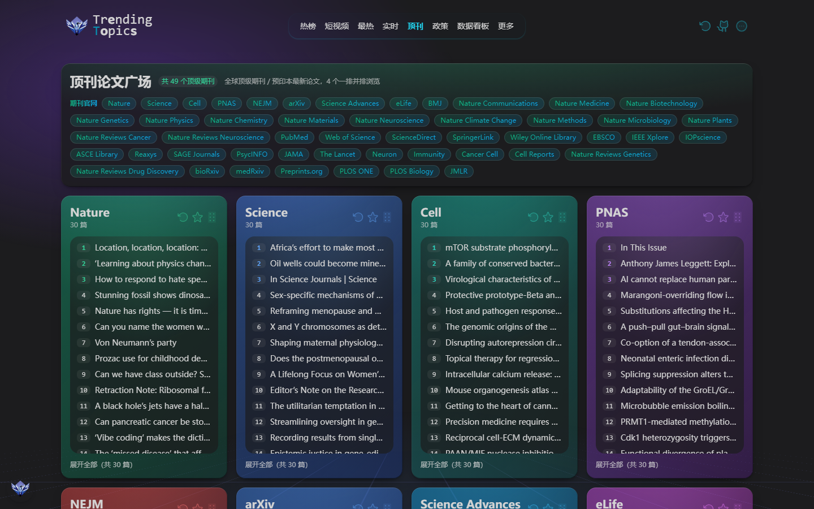
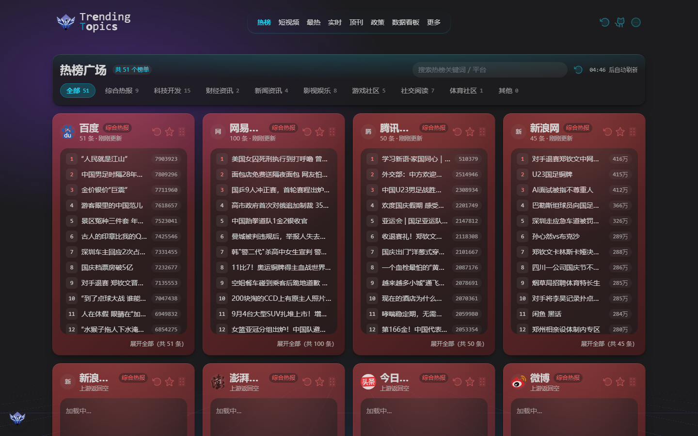

# Qianyuniao Trending Topics

一个自托管的**全网热点聚合看板**：把新闻热榜、短视频榜、顶级期刊 / 预印本、各国政府政策与官方统计数据，集中到同一个可拖拽的看板里。

前后端同构部署，内置 **51 个热榜平台适配器**与 **176 个内容源**，离线可用（PWA），支持 GitHub 登录同步「关注」栏目。

- 许可证：MIT
- 环境要求：Node.js 18 及以上、pnpm 10

---

## 界面预览

### 统计数据看板

国家统计局、央行、财政部的官方数据发布，顶部按领域聚合 38 个国内外权威数据平台入口。



### 国家政策广场

国务院及 49 个部委官网的政策、公文与解读，顶部可直达各部委官网。



### 顶刊论文广场

49 个顶级期刊与预印本平台，涵盖 Nature、Science、Cell 系顶刊与 JAMA、Lancet、bioRxiv 等。



### 热搜广场

51 个平台的热榜聚合，支持分类筛选、关键词搜索与自动刷新。



---

## 目录

- [界面预览](#界面预览)
- [功能特性](#功能特性)
- [技术栈](#技术栈)
- [快速开始](#快速开始)
- [环境变量](#环境变量)
- [可用脚本](#可用脚本)
- [部署](#部署)
- [项目结构](#项目结构)
- [数据源机制](#数据源机制)
- [缓存与数据一致性](#缓存与数据一致性)
- [常见问题](#常见问题)
- [许可证](#许可证)

---

## 功能特性

| 模块 | 路由 | 说明 | 源数量 |
| --- | --- | --- | --- |
| 热榜 | `/hotboard` | 51 个平台热榜聚合，支持分类筛选、关键词搜索、自动刷新倒计时 | 51 |
| 短视频 | `/shortvideo` | 抖音 / 快手 / B 站 / AcFun / 爱奇艺 / 好看 / 小红书 | 7 || 最热 | `/c/hottest` | 跨平台综合热点榜 | 37 |
| 实时 | `/c/realtime` | 实时更新的资讯与财经快讯流 | 22 |
| 顶刊广场 | `/journals` | Nature、Science、Cell 系顶刊，JAMA、Lancet、Neuron、Immunity、Cancer Cell，bioRxiv、medRxiv、JMLR 等 | 49 |
| 政策广场 | `/policies` | 国务院及 49 个部委官网最新政策、公文与解读 | 49 |
| 统计数据看板 | `/dashboard` | 国家统计局、央行、财政部官方数据，外加国际权威统计机构入口 | 6 + 38 链接 |
**其它能力**

- **可拖拽看板**：卡片顺序持久化到 `localStorage`，基于 `@atlaskit/pragmatic-drag-and-drop`
- **卡片式关注**：任意源可「加入关注」，跨设备通过 GitHub OAuth 同步
- **PWA**：Service Worker 预缓存与离线回退，可安装到桌面与手机
- **多部署预设**：Node Server、Cloudflare Pages（含 D1）、Vercel Edge、Bun
- **官网导航**：各广场顶部按领域聚合官网入口，渐变标签直达原站
- **智能缓存**：按源自身更新间隔 `interval` 控制新鲜度，支持手动强刷

---

## 技术栈

### 前端

| 依赖 | 用途 |
| --- | --- |
| React 19 | 视图层 |
| Vite 7 | 构建与开发服务器（`@vitejs/plugin-react-swc` 加速） || TanStack Router | 文件式路由，`src/routes/*.tsx` 自动生成 `routeTree.gen.ts` |
| TanStack Query | 服务端数据缓存、轮询、重试策略 |
| Jotai | 轻量原子状态（当前栏目、关注源、拖拽上下文） |
| UnoCSS | 原子化 CSS，presetWind3 + presetIcons，内置 `sprinkle-*`、`gp-*`、`panel-outline` 等预设 |
| framer-motion | 视口懒加载动画与入场编排 |
| Overlayscrollbars、ahooks、cmdk、dayjs、react-use | 滚动条、Hooks、命令面板、时间、工具 Hook |
| vite-plugin-pwa + workbox | PWA 预缓存与离线 |
### 服务端

| 依赖 | 用途 |
| --- | --- |
| Nitro + h3 | 同构服务端，提供 `/api/*` 接口 |
| db0 + better-sqlite3 | 缓存与用户表，Cloudflare Pages 下切换为 D1 |
| ofetch | 带重试与超时的 HTTP 客户端 |
| **cheerio** | 政府网站 HTML 解析，政策抓取核心 |
| **fast-xml-parser** | RSS 2.0 / RSS 1.0(RDF) / Atom 统一解析，期刊与预印本核心 |
| iconv-lite | 字符集兜底 |
| jose、md5、cookie-es | JWT 签发校验、签名、Cookie 解析 |
| vite-plugin-with-nitro | 把 Nitro 集成进 Vite 开发与构建流程 |
### 工程化

- **包管理**：pnpm 10，通过 `packageManager` 字段锁定版本（含 `patchedDependencies`）
- **类型**：TypeScript 5，`tsconfig.node.json` / `tsconfig.app.json` / `tsconfig.base.json` 三段式
- **规范**：ESLint 9 + `@ourongxing/eslint-config`，`simple-git-hooks` + `lint-staged` 提交前自动修复
- **测试**：Vitest
- **自动导入**：`unimport` 扫描 `server/utils` 与 `shared`，业务代码无需手写 import

---

## 快速开始

### 1. 安装依赖

```bash
git clone https://github.com/qianyuniao/Qianyuniao-TrendingTopics.git
cd Qianyuniao-TrendingTopics
corepack enable
pnpm install
```

> **关于 `corepack enable`**
>
> Corepack 是 Node.js 自带的包管理器版本管理工具（随 Node 一起安装，无需额外装）。它本身不包含 pnpm，而是创建一层 `pnpm` 命令垫片：当你执行 `pnpm` 时，它会读取 `package.json` 里声明的 `"packageManager": "pnpm@10.30.3"`，自动下载并使用该精确版本。
>
> 这样做的原因：本项目使用了 pnpm 专属的 `patchedDependencies`（给 dayjs 打了补丁）与 `overrides` 配置。**请勿改用 npm 或 yarn 安装依赖**，否则补丁不会生效，可能导致构建异常。
>
> 如果 `corepack enable` 报错（少数环境下 Node 安装目录不可写），可退回全局安装指定版本：`npm i -g pnpm@10.30.3`。

> `better-sqlite3` 是原生模块，安装时会触发预编译下载；若失败，请确保本机具备 C++ 构建工具链。

### 2. 准备环境变量（可选）

**不配置也能直接跑**，所有变量都有降级逻辑。仅在需要登录同步、Cookie 类数据源或代理时才需要：

```bash
cp config-sample/example.env.server .env.server
```

### 3. 启动开发服务器

```bash
pnpm dev
```

打开 <http://localhost:5173>。`dev` 会先执行 `presource` 生成数据源清单与站点图标，再启动 Vite 与 Nitro。
### 4. 生产构建与运行

```bash
pnpm build
pnpm start
```

---

## 环境变量

全部为**可选**，留空即降级运行。完整模板见 `config-sample/example.env.server`。

| 变量 | 作用 | 缺失时行为 |
| --- | --- | --- |
| `G_CLIENT_ID` | GitHub OAuth 应用 ID | 隐藏登录入口 |
| `G_CLIENT_SECRET` | GitHub OAuth 应用密钥 | 无法完成登录回调 |
| `JWT_SECRET` | 会话令牌签名密钥，启用登录时必填 | 无法签发令牌 |
| `INIT_TABLE` | 首次启动是否建表，默认 true | 设为 false 跳过建表 |
| `ENABLE_CACHE` | 是否启用数据库缓存，默认 true | 设为 false 每次实时抓取 || `HOTBOARD_CACHE_TTL` | 热榜内存缓存秒数，默认 60 | 使用默认值 |
| `PRODUCTHUNT_API_TOKEN` | Product Hunt API Token | 该卡片回退为 RSS |
| `XIAOHONGSHU_COOKIE` | 小红书热榜 Cookie，含 a1、web_session 等 | 小红书热榜返回空 |
| `XIAOHONGSHU_XS` / `XIAOHONGSHU_XT` | 小红书 web 接口签名头，缺失易返回 406 | 降级 |
| `WEIXIN_CHANNELS_COOKIE` | 微信视频号热榜 Cookie，实验性 | 视频号热榜返回空 |
| `HTTPS_PROXY` / `HTTP_PROXY` | 上游代理，`dev` 脚本已带 `--use-env-proxy` | 直连 |
> 生产环境另可用 `NODE_USE_ENV_PROXY=1` 让 Node 原生 fetch 走代理。

---

## 可用脚本

| 命令 | 说明 |
| --- | --- |
| `pnpm dev` | 生成数据源后启动开发服务器 |
| `pnpm build` | 构建产物到 `dist/output`，含前端 public 与服务端 server |
| `pnpm start` | 以 Node Server 运行构建产物 |
| `pnpm presource` | 仅重新生成 `sources.json`、`pinyin.json` 与站点图标 |
| `pnpm typecheck` | 分别检查服务端与前端类型 |
| `pnpm lint` | ESLint 检查，配合 `--fix` 自动修复 |
| `pnpm test` | 运行 Vitest || `pnpm preview` | 以 Cloudflare Pages 预设构建并用 Wrangler 本地预览 |
| `pnpm deploy` | 部署到 Cloudflare Pages |
| `pnpm log` | 查看 Cloudflare Pages 部署日志 |
| `pnpm release` | 基于 conventional commits 自动升版本并打 tag |

---

## 部署

部署预设由环境变量切换，逻辑见 `configs/nitro.ts`。

### Node Server（默认）

```bash
pnpm build && pnpm start
```

### Cloudflare Pages

1. 复制 `config-sample/example.wrangler.toml` 为 `wrangler.toml`
2. 填入 D1 的 `database_id`，可用 `wrangler d1 create qianyuniao-trendingtopics-db` 创建
3. 执行 `pnpm deploy`
> Pages 环境为 Edge 运行时，无原生 SQLite，缓存自动落到 D1；标记 `disable: "cf"` 的源（如快手）会被自动排除。

### Vercel

设置 `VERCEL=1`，框架选择 Edge。由于 Edge 无 Node SQLite，需搭配外部缓存，或用 `ENABLE_CACHE=false` 关闭缓存。

### Bun

设置 `BUN=1`，使用 `bun-sqlite` 连接器。

---

## 项目结构

```
.
├── configs/            构建配置（nitro、pwa、unocss 等）
│   └── nitro.ts        按环境变量切换部署预设与数据库连接器
├── scripts/            构建期脚本
│   ├── favicon.ts      抓取各站点 favicon
│   └── source.ts       由 pre-sources 生成 sources.json 与 pinyin.json├── shared/             前后端共享
│   ├── pre-sources.ts  所有数据源的声明式定义（源头）
│   ├── sources.json    构建期产物，勿手改
│   ├── metadata.ts     栏目、配色、各广场列表
│   ├── types.ts        Source、NewsItem、SourceResponse 等类型
│   └── hotboard.ts     热榜平台与分类
├── server/             服务端（Nitro）
│   ├── api/            接口层：s、hotboard、oauth、me 等
│   ├── sources/        抓取器，一个文件即一个 source id
│   ├── hotboard/       热榜平台适配器，共 51 个
│   ├── utils/          抓取与解析工具
│   └── database/       db0 缓存与用户表├── src/                前端
│   ├── routes/         文件式路由
│   ├── components/     看板卡片、布局、通用组件
│   ├── hooks/          自定义 Hooks
│   └── atoms/          Jotai 状态
└── config-sample/      环境变量与 wrangler 配置模板
```

---

## 数据源机制

数据流是**声明式**的，新增一个源通常不需要写业务代码：

```
shared/pre-sources.ts  --(pnpm presource)-->  shared/sources.json
                                                     |
                                      生成 SourceID 类型与站点信息
                                                     v
server/sources/<id>.ts  <--  抓取器（文件名即 source id）
        |
        v
server/getters.ts 自动 glob 收集 --> /api/s?id=<id> --> 前端卡片
```
### 抓取器的几种来源

| 工厂函数 | 适用场景 |
| --- | --- |
| `defineSource` | 自定义抓取逻辑，API 或 HTML 解析 |
| `defineJournalSource` | 期刊与预印本，解析 RSS 2.0、RSS 1.0(RDF)、Atom |
| `defineCrossrefSource` | 走 Crossref API 的出版商，按 member ID |
| `proxySource` | 部署到 Cloudflare Pages 时把请求代理到自有服务 |

### 政府政策源的特殊处理

`server/utils/policy.ts` 面向政府官网做了额外适配：

- **字符集兜底**：按响应头或 meta 声明解码，兼容 GB2312、GBK、GB18030 站点
- **JS 反爬绕过**：检测到挑战页时，在 `node:vm` 沙箱内执行挑战脚本解出 Cookie 后重试，最多 3 次
- **容器聚合兜底**：按最近的 ul、dl、ol 分组，选深层内容链接最多的列表容器，避开导航与机构名单
- **降噪**：过滤备案号与页脚、同标题重复、跨站通用链接、响应式副本导致的重复拼接标题
- **备用地址**：主地址失败时自动切换备用列表页
新增一个部门只需在 `policySources` 数组追加一项：

```ts
{ id: "policy_xxx", name: "某某部", url: "https://www.example.gov.cn/zwgk/", mode: "container" }
```

---

## 缓存与数据一致性

- 每个源通过 `interval` 声明自己的更新频率，从 `Time.Fast` 5 分钟到 `Time.Slow` 1 小时
- 请求命中 `interval` 内的缓存会直接返回，`latest` 参数可强刷，但仍受 `interval` 保护
- 持久化缓存位于 `.data/db.sqlite3`，可用 `ENABLE_CACHE=false` 关闭
- 修改源配置后若内容没变化，需清理 `.data/db.sqlite3` 的 `cache` 表，或等待一个 `interval`
---

## 常见问题

**卡片显示「获取失败」怎么办？**

多为上游站点反爬、限流或网络不可达。先点卡片右上角刷新重试；若持续失败，通常是目标站点改版或封禁了服务端请求。

**为什么改了配置内容却没变？**

请求命中了 `interval` 内的缓存，清理 `.data/db.sqlite3` 的 `cache` 表即可。

**部分数据源是空的？**

小红书、微信视频号需要配置 Cookie；Product Hunt 需要 API Token；部分海外站点在特定网络下不可达。

**如何新增一个数据源？**

见上文「数据源机制」，多数情况下只需在 `shared/pre-sources.ts` 声明，并在 `server/sources/` 写一个抓取器文件。

---

## 许可证

[MIT](./LICENSE) © qianyuniao